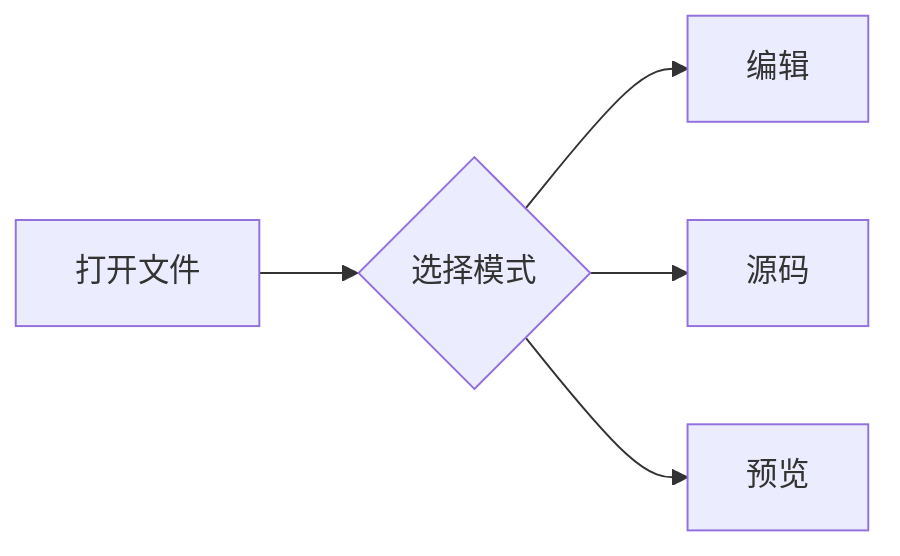
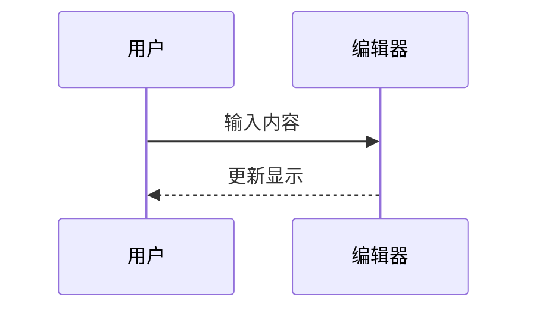
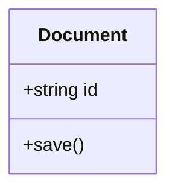
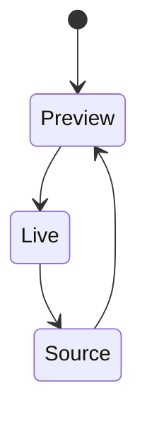
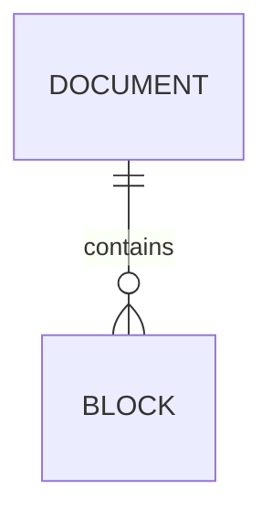

```mermaid
flowchart LR
 A[打开文件] --> B{选择模式}
 B --> C[编辑]
 B --> D[源码]
 B --> E[预览]
```

```mermaid
sequenceDiagram
 participant U as 用户
 participant E as 编辑器
 U->>E: 输入内容
 E-->>U: 更新显示
```

```mermaid
classDiagram
 class Document {
 +string id
 +save()
 }
```

```mermaid
stateDiagram-v2
 [*] --> Preview
 Preview --> Live
 Live --> Source
 Source --> Preview
```

```mermaid
erDiagram
 DOCUMENT ||--o{ BLOCK : contains
```
